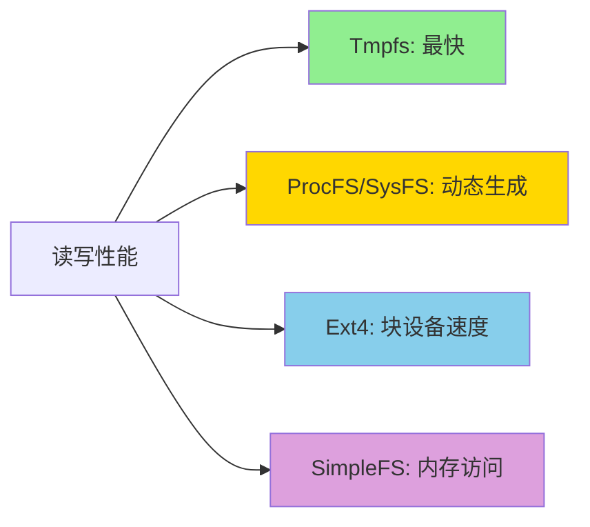
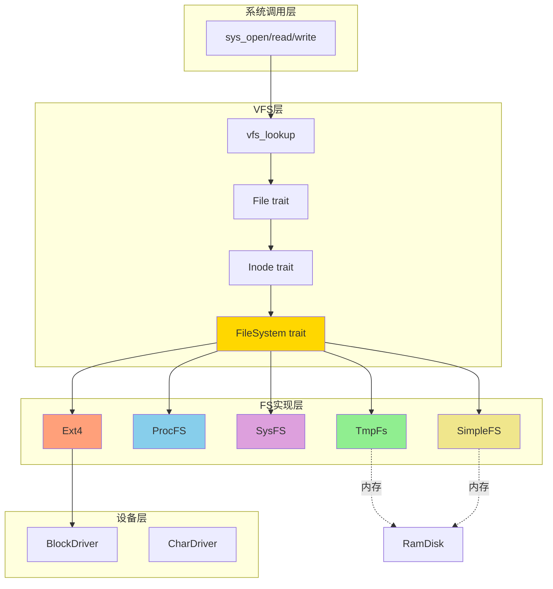

# 文件系统模块 (FS)

## 概述

FS 模块是 comix 内核的文件系统实现层，提供了多种具体的文件系统类型。这些文件系统通过实现 VFS 的 `FileSystem` 和 `Inode` trait，与虚拟文件系统层无缝集成。

## 支持的文件系统

comix 内核目前支持以下文件系统类型：

| 文件系统 | 类型 | 用途 | 持久化 | 特点 |
|---------|------|------|--------|------|
| [Tmpfs](tmpfs.md) | 内存 | 临时存储 | ❌ | 快速、容量可配置 |
| [ProcFS](procfs.md) | 伪文件系统 | 进程信息 | ❌ | 动态生成、只读 |
| [SysFS](sysfs.md) | 伪文件系统 | 系统设备 | ❌ | 设备树、属性导出 |
| [Ext4](ext4.md) | 磁盘 | 持久化存储 | ✅ | Linux标准、完整读写 |
| [SimpleFS](simple_fs.md) | 测试 | 调试/测试 | ❌ | 预加载镜像 |

## 文件系统特性对比

### 性能特性



### 使用场景

#### Tmpfs - 临时文件存储
```rust
// 适用场景：
// - /tmp 目录
// - 进程间共享内存
// - 构建系统的临时产物

mount_tmpfs("/tmp", 64)?;  // 挂载64MB tmpfs到/tmp
```

**优点**:
- 读写速度快（纯内存操作）
- 容量可配置
- 支持完整的POSIX语义

**限制**:
- 重启后数据丢失
- 占用内核内存

#### ProcFS - 进程信息导出
```rust
// 适用场景：
// - 进程状态查询
// - 系统监控工具
// - 调试和诊断

// 读取进程信息
let stat = read_to_string("/proc/1/stat")?;
let status = read_to_string("/proc/self/status")?;
```

**优点**:
- 标准Linux接口
- 动态生成，无存储开销
- 易于扩展新条目

**限制**:
- 只读文件系统
- 数据实时性依赖内核状态

#### SysFS - 设备信息导出
```rust
// 适用场景：
// - 设备发现
// - 驱动参数配置
// - 设备状态监控

// 查询设备信息
let class = read_to_string("/sys/class/block/vda/dev")?;
```

**优点**:
- 统一的设备接口
- 支持设备热插拔
- 层次化设备树

**限制**:
- 只读（当前实现）
- 需要设备驱动支持

#### Ext4 - 持久化存储
```rust
// 适用场景：
// - 根文件系统
// - 用户数据存储
// - 配置文件持久化

init_ext4_from_block_device()?;  // 挂载ext4为根文件系统
```

**优点**:
- 数据持久化
- Linux标准格式
- 可与Linux主机交换数据

**限制**:
- 需要块设备支持
- 性能受硬件限制
- 部分高级特性未支持（mknod等）

#### SimpleFS - 测试与调试
```rust
// 适用场景：
// - 单元测试
// - 快速原型
// - 预加载测试数据

init_simple_fs()?;  // 从编译时嵌入的镜像加载
```

**优点**:
- 镜像编译时嵌入
- 快速启动
- 测试环境一致

**限制**:
- 只读
- 镜像大小受限
- 仅用于测试

## 架构设计

### FS层与VFS层的关系



### 文件系统初始化流程

```rust
pub fn init_filesystems() -> Result<(), FsError> {
    // 1. 挂载根文件系统 (Ext4 或 SimpleFS)
    #[cfg(feature = "ext4")]
    init_ext4_from_block_device()?;
    
    #[cfg(not(feature = "ext4"))]
    init_simple_fs()?;
    
    // 2. 创建必要的目录
    let root = vfs::get_root_dentry()?;
    root.inode.mkdir("dev", FileMode::S_IFDIR | FileMode::S_IRWXU)?;
    root.inode.mkdir("proc", FileMode::S_IFDIR | FileMode::S_IRWXU)?;
    root.inode.mkdir("sys", FileMode::S_IFDIR | FileMode::S_IRWXU)?;
    root.inode.mkdir("tmp", FileMode::S_IFDIR | FileMode::S_IRWXU)?;
    
    // 3. 挂载伪文件系统
    init_procfs()?;
    init_sysfs()?;
    
    // 4. 挂载tmpfs到/tmp
    mount_tmpfs("/tmp", 64)?;  // 64MB
    
    // 5. 初始化设备文件
    init_dev()?;
    
    pr_info!("All filesystems initialized successfully");
    Ok(())
}
```

## 快速开始

### 挂载文件系统

#### 挂载Tmpfs

```rust
use crate::fs::mount_tmpfs;

// 挂载64MB的tmpfs到/tmp
mount_tmpfs("/tmp", 64)?;

// 无限制大小的tmpfs
mount_tmpfs("/run", 0)?;
```

#### 挂载ProcFS

```rust
use crate::fs::init_procfs;

// 挂载procfs到/proc
init_procfs()?;

// 读取进程状态
let stat = vfs_load_file("/proc/1/stat")?;
```

#### 挂载SysFS

```rust
use crate::fs::init_sysfs;

// 挂载sysfs到/sys
init_sysfs()?;

// 查询块设备
let dev = vfs_load_file("/sys/class/block/vda/dev")?;
```

### 文件操作示例

所有文件系统都通过VFS层统一操作：

```rust
// 打开文件（无论什么文件系统）
let fd = sys_open("/tmp/test.txt", 
    OpenFlags::O_WRONLY | OpenFlags::O_CREAT,
    FileMode::S_IRUSR | FileMode::S_IWUSR)?;

// 写入数据
sys_write(fd, b"Hello, FS!")?;
sys_close(fd)?;

// 读取数据
let fd = sys_open("/tmp/test.txt", OpenFlags::O_RDONLY, FileMode::empty())?;
let mut buf = vec![0u8; 128];
let n = sys_read(fd, &mut buf)?;
sys_close(fd)?;

println!("Read {} bytes: {}", n, String::from_utf8_lossy(&buf[..n]));
```

## 实现新文件系统

### 步骤1：实现FileSystem trait

```rust
use alloc::sync::Arc;
use crate::vfs::{FileSystem, Inode, FsError, StatFs};

pub struct MyFS {
    root: Arc<MyFsInode>,
}

impl FileSystem for MyFS {
    fn fs_type(&self) -> &'static str {
        "myfs"
    }
    
    fn root_inode(&self) -> Arc<dyn Inode> {
        self.root.clone()
    }
    
    fn sync(&self) -> Result<(), FsError> {
        // 同步数据到持久化存储
        Ok(())
    }
    
    fn statfs(&self) -> Result<StatFs, FsError> {
        Ok(StatFs {
            block_size: 4096,
            total_blocks: 1000,
            free_blocks: 500,
            // ...
        })
    }
}
```

### 步骤2：实现Inode trait

```rust
struct MyFsInode {
    inode_no: usize,
    inode_type: InodeType,
    // ... 其他字段
}

impl Inode for MyFsInode {
    fn metadata(&self) -> Result<InodeMetadata, FsError> {
        // 返回文件元数据
    }
    
    fn read_at(&self, offset: usize, buf: &mut [u8]) 
        -> Result<usize, FsError> {
        // 读取文件数据
    }
    
    fn write_at(&self, offset: usize, buf: &[u8]) 
        -> Result<usize, FsError> {
        // 写入文件数据
    }
    
    fn lookup(&self, name: &str) -> Result<Arc<dyn Inode>, FsError> {
        // 查找子文件/目录
    }
    
    // ... 实现其他必需方法
}
```

### 步骤3：注册和挂载

```rust
pub fn init_myfs() -> Result<(), FsError> {
    let myfs = Arc::new(MyFS::new());
    
    MOUNT_TABLE.mount(
        myfs,
        "/mnt/myfs",
        MountFlags::empty(),
        Some(String::from("myfs")),
    )?;
    
    Ok(())
}
```

## 配置选项

### 编译时配置

在 `Cargo.toml` 中配置特性：

```toml
[features]
default = ["ext4"]
ext4 = []
devfs = []
```

### 运行时配置

```rust
// config.rs

/// Tmpfs 默认最大大小 (MB)
pub const TMPFS_DEFAULT_SIZE: usize = 64;

/// Ext4 块大小
pub const EXT4_BLOCK_SIZE: usize = 4096;

/// SimpleFS 镜像路径
pub const SIMPLE_FS_IMAGE: &str = env!("SIMPLE_FS_IMAGE");
```

## 调试与监控

### 查看挂载点

```rust
// 列出所有挂载点
let mounts = MOUNT_TABLE.list_mounts();
for (path, fstype) in mounts {
    pr_info!("Mount point: {}, Type: {}", path, fstype);
}
```

### 文件系统统计

```rust
// 获取文件系统统计信息
let root = vfs::get_root_dentry()?;
let statfs = root.inode.fs()?.statfs()?;

pr_info!("Block size: {}", statfs.block_size);
pr_info!("Total blocks: {}", statfs.total_blocks);
pr_info!("Free blocks: {}", statfs.free_blocks);
```

## 性能优化

### Tmpfs优化建议

1. **合理设置容量限制**: 避免无限制使用导致OOM
2. **及时清理临时文件**: 释放内存
3. **大文件使用块设备**: Tmpfs适合小文件

### Ext4优化建议

1. **块大小对齐**: 确保DMA传输对齐
2. **预读策略**: 顺序读取时启用预读
3. **缓存管理**: 合理使用页缓存

### ProcFS/SysFS优化建议

1. **延迟生成**: 只在读取时生成内容
2. **缓存静态数据**: 不变的数据可以缓存
3. **批量读取**: 减少系统调用次数

## 最佳实践

### 1. 选择合适的文件系统

- **临时数据** → Tmpfs
- **持久化数据** → Ext4
- **进程信息** → ProcFS
- **设备信息** → SysFS
- **测试环境** → SimpleFS

### 2. 错误处理

```rust
match init_ext4_from_block_device() {
    Ok(_) => pr_info!("Ext4 mounted successfully"),
    Err(FsError::NoDevice) => {
        pr_warn!("No block device, fallback to SimpleFS");
        init_simple_fs()?;
    }
    Err(e) => return Err(e),
}
```

### 3. 资源管理

```rust
// 及时卸载不需要的文件系统
MOUNT_TABLE.umount("/mnt/temp")?;

// 同步数据到持久化存储
vfs::sync_all()?;
```

## 故障排查

### 常见问题

#### 挂载失败

**问题**: `init_ext4_from_block_device()` 返回 `NoDevice`

**原因**: 没有可用的块设备

**解决**: 检查块设备驱动是否正确初始化

```rust
let drivers = BLK_DRIVERS.read();
pr_info!("Found {} block devices", drivers.len());
```

#### 文件不存在

**问题**: 读取ProcFS文件返回 `NotFound`

**原因**: 进程不存在或文件未注册

**解决**: 检查进程ID，确认Generator已注册

#### 权限拒绝

**问题**: 写入文件返回 `PermissionDenied`

**原因**: 文件系统只读或权限不足

**解决**: 检查文件系统类型和挂载标志

## 相关资源

### 文档导航

- [VFS 架构](../vfs/architecture.md)
- [Tmpfs 详解](tmpfs.md)
- [ProcFS 详解](procfs.md)
- [SysFS 详解](sysfs.md)
- [Ext4 详解](ext4.md)
- [SimpleFS 详解](simple_fs.md)

### 源代码位置

- **FS 模块**: `os/src/fs/`
- **Tmpfs**: `os/src/fs/tmpfs/`
- **ProcFS**: `os/src/fs/proc/`
- **SysFS**: `os/src/fs/sysfs/`
- **Ext4**: `os/src/fs/ext4/`
- **SimpleFS**: `os/src/fs/simple_fs.rs`

### 参考标准

- [Linux VFS Documentation](https://www.kernel.org/doc/html/latest/filesystems/vfs.html)
- [Ext4 Disk Layout](https://ext4.wiki.kernel.org/index.php/Ext4_Disk_Layout)
- [Linux /proc Filesystem](https://www.kernel.org/doc/html/latest/filesystems/proc.html)
- [Linux /sys Filesystem](https://www.kernel.org/doc/html/latest/filesystems/sysfs.html)
