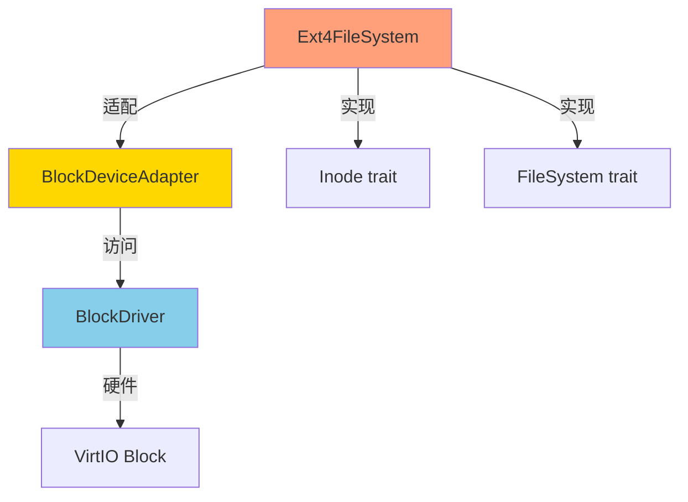

# Ext4 - Linux Ext4文件系统支持

## 概述

Ext4 文件系统支持允许 comix 内核访问 Linux Ext4 格式的文件系统，支持完整的读写操作。

**主要特点**:
- ✅ 完整读写：支持文件读写、创建、删除、重命名
- ✅ 目录操作：支持mkdir、rmdir、readdir
- ✅ 链接操作：支持symlink、link、readlink
- ✅ 元数据：支持chmod、chown、set_times
- ✅ 块设备适配：通过BlockDriver接口访问
- ✅ 标准格式：兼容Linux ext4
- ⚠️ 部分特性：mknod未实现

## 架构设计



### BlockDeviceAdapter

```rust
pub struct BlockDeviceAdapter {
    driver: Arc<dyn BlockDriver>,
    block_size: usize,
    offset: usize,  // 分区偏移（扇区）
}

impl BlockDeviceAdapter {
    /// 读取块（以ext4块为单位，通常4KB）
    pub fn read_block(&self, block_id: usize, buf: &mut [u8]) 
        -> Result<(), FsError> {
        // 将ext4块转换为设备扇区
        let sector_size = 512;
        let sectors_per_block = self.block_size / sector_size;
        let start_sector = block_id * sectors_per_block + self.offset;
        
        // 读取扇区
        for i in 0..sectors_per_block {
            let sector_buf = &mut buf[i * sector_size..(i + 1) * sector_size];
            self.driver.read_block(start_sector + i, sector_buf)?;
        }
        
        Ok(())
    }
}
```

## 挂载Ext4

### 从块设备挂载

```rust
use crate::fs::init_ext4_from_block_device;

// 自动检测并挂载第一个块设备上的ext4
init_ext4_from_block_device()?;
```

### 配置参数

```rust
// config.rs
pub const EXT4_BLOCK_SIZE: usize = 4096;  // 必须与mkfs.ext4 -b 匹配
pub const FS_IMAGE_SIZE: usize = 128 * 1024 * 1024;  // 128MB
```

## 使用示例

```rust
// 读取ext4文件系统中的文件
let content = vfs_load_file("/bin/ls")?;

// 列出目录
let bin = vfs_lookup("/bin")?;
let entries = bin.inode.readdir()?;
for entry in entries {
    pr_info!("File: {}", entry.name);
}
```

## 创建Ext4镜像

```bash
# 创建128MB镜像
dd if=/dev/zero of=fs.img bs=1M count=128

# 格式化为ext4（块大小4KB）
mkfs.ext4 -b 4096 fs.img

# 挂载并复制文件
sudo mount -o loop fs.img /mnt
sudo cp -r myfiles/* /mnt/
sudo umount /mnt
```

## 限制与注意事项

### 当前限制

1. **mknod**: 不支持创建设备文件
2. **块大小**: 必须是4096字节
3. **崩溃安全**: 非日志模式，系统崩溃可能导致不一致

### 块大小对齐

```rust
// ⚠️ 重要：确保块大小匹配
// mkfs.ext4 -b 4096 fs.img
pub const EXT4_BLOCK_SIZE: usize = 4096;  // 必须匹配mkfs参数
```

## 性能考虑

- **块缓存**: 实现块缓存可显著提升性能
- **预读**: 顺序读取时启用预读
- **DMA对齐**: 确保缓冲区对齐以使用DMA

## 相关资源

- **源代码**: `os/src/fs/ext4/`
- **适配器**: `os/src/fs/ext4/adapters.rs`
- [Ext4 Disk Layout](https://ext4.wiki.kernel.org/index.php/Ext4_Disk_Layout)
- [FS模块概览](README.md)
