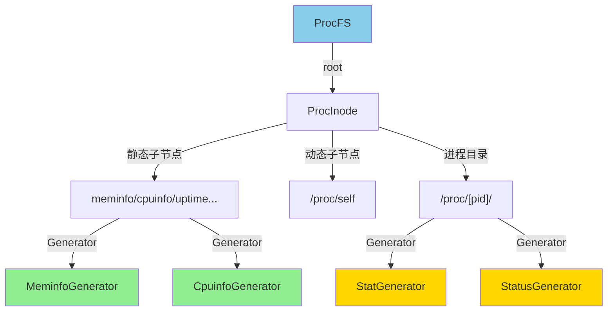

# ProcFS - 进程信息文件系统

## 概述

ProcFS 是一个虚拟文件系统，用于导出内核状态和进程信息。所有文件内容都是动态生成的，不占用磁盘空间。

**主要特点**:
- 虚拟文件系统：文件内容动态生成
- 只读：不支持写入操作
- 标准接口：兼容Linux `/proc` 接口
- 可扩展：易于添加新的信息导出

## 架构设计

### 核心组件



### Generator机制

所有proc文件使用Generator模式动态生成内容：

```rust
pub trait Generator: Send + Sync {
    /// 生成文件内容
    fn generate(&self) -> alloc::vec::Vec<u8>;
}

// 示例：内存信息生成器
pub struct MeminfoGenerator;

impl Generator for MeminfoGenerator {
    fn generate(&self) -> Vec<u8> {
        let total = get_total_memory();
        let free = get_free_memory();
        
        format!(
            "MemTotal: {} kB\nMemFree: {} kB\nMemAvailable: {} kB\n",
            total / 1024,
            free / 1024,
            free / 1024
        ).into_bytes()
    }
}
```

## 文件列表

### 系统信息文件

| 文件 | 内容 | 示例 |
|------|------|------|
| `/proc/meminfo` | 内存使用信息 | `MemTotal: 2048 MB` |
| `/proc/cpuinfo` | CPU信息 | `processor: 0` |
| `/proc/uptime` | 系统运行时间 | `12345.67 12345.67` |
| `/proc/mounts` | 挂载点列表 | `tmpfs /tmp tmpfs rw 0 0` |

### 进程信息文件

| 文件 | 内容 | 生成器 |
|------|------|--------|
| `/proc/[pid]/cmdline` | 命令行参数 | CmdlineGenerator |
| `/proc/[pid]/stat` | 进程状态 | StatGenerator |
| `/proc/[pid]/status` | 详细状态 | StatusGenerator |
| `/proc/[pid]/maps` | 内存映射 | MapsGenerator |

### 特殊符号链接

| 链接 | 目标 |  说明 |
|------|------|--------|
| `/proc/self` | `/proc/[current_pid]` | 指向当前进程 |

## 使用示例

### 读取系统信息

```rust
// 读取内存信息
let meminfo = vfs_load_file("/proc/meminfo")?;
pr_info!("Memory info:\n{}", String::from_utf8_lossy(&meminfo));

// 读取CPU信息
let cpuinfo = vfs_load_file("/proc/cpuinfo")?;

// 读取系统运行时间
let uptime = vfs_load_file("/proc/uptime")?;
```

### 读取进程信息

```rust
// 读取当前进程状态
let stat = vfs_load_file("/proc/self/stat")?;

// 读取特定进程的状态
let pid1_status = vfs_load_file("/proc/1/status")?;

// 读取命令行参数
let cmdline = vfs_load_file("/proc/self/cmdline")?;
```

## 添加新的Proc文件

###  步骤1：实现Generator

```rust
pub struct MyInfoGenerator;

impl Generator for MyInfoGenerator {
    fn generate(&self) -> Vec<u8> {
        format!("my_value: {}\n", get_my_value())
            .into_bytes()
    }
}
```

### 步骤2：注册到ProcFS

```rust
pub fn init_tree(self: &Arc<Self>) -> Result<(), FsError> {
    // ... 其他文件 ...
    
    // 添加新文件
    let myinfo = ProcInode::new_dynamic_file(
        "myinfo",
        Arc::new(MyInfoGenerator),
        FileMode::from_bits_truncate(0o444),
    );
    root.add_child("myinfo", myinfo)?;
    
    Ok(())
}
```

## 相关资源

- **源代码**: `os/src/fs/proc/`
- **生成器**: `os/src/fs/proc/generators/`
- [FS模块概览](README.md)
