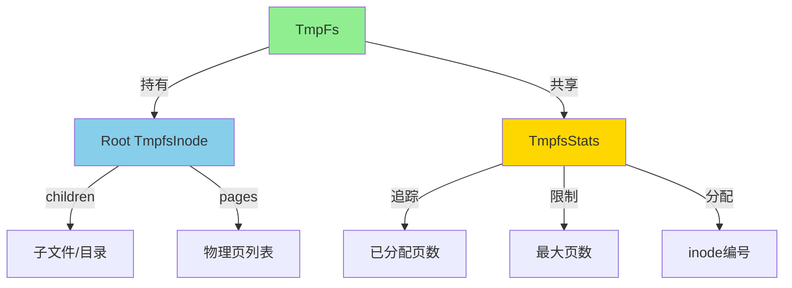

# Tmpfs - 临时文件系统

## 概述

Tmpfs (Temporary File System) 是一个完全基于内存的文件系统实现，提供快速的文件读写性能。所有数据均存储在物理内存中，系统重启后数据会丢失。

**主要特点**:
- ✅ 高性能：纯内存操作，无磁盘I/O
- ✅ 动态分配：按需分配物理页
- ✅ 容量控制：可配置最大内存使用量
- ✅ 完整语义：支持完整的POSIX文件系统语义
- ❌ 非持久化：重启后数据丢失

## 架构设计

### 核心组件



### 数据结构

#### TmpFs - 文件系统结构

```rust
pub struct TmpFs {
    /// 根 inode
    root: Arc<TmpfsInode>,
    
    /// 全局统计信息
    stats: Arc<Mutex<TmpfsStats>>,
}

pub struct TmpfsStats {
    /// 已分配的物理页数
    allocated_pages: usize,
    
    /// 最大页数限制 (0 = 无限制)
    max_pages: usize,
    
    /// 下一个可用的 inode 编号
    next_inode_no: usize,
}
```

#### TmpfsInode - 文件/目录节点

```rust
pub struct TmpfsInode {
    /// Inode 编号
    inode_no: usize,
    
    /// 节点类型 (文件/目录/符号链接)
    inode_type: InodeType,
    
    /// 核心元数据
    inner: SpinLock<TmpfsInodeInner>,
    
    /// 物理页列表 (仅文件类型使用)
    pages: Mutex<Vec<PhysAddr>>,
    
    /// 子节点 (仅目录类型使用)
    children: SpinLock<BTreeMap<String, Arc<TmpfsInode>>>,
    
    /// 父目录的弱引用
    parent: Weak<TmpfsInode>,
    
    /// 全局统计信息
    stats: Arc<Mutex<TmpfsStats>>,
}

struct TmpfsInodeInner {
    mode: FileMode,
    uid: u32,
    gid: u32,
    size: usize,
    atime: TimeSpec,
    mtime: TimeSpec,
    ctime: TimeSpec,
    nlinks: usize,
    /// 符号链接目标 (仅 Symlink 类型)
    symlink_target: Option<String>,
}
```

## 内存管理

### 页面分配策略

Tmpfs 采用按需分配策略：

1. **延迟分配**: 创建文件时不分配内存
2. **写时分配**: 第一次写入时才分配物理页
3. **页对齐**: 所有数据按页（4KB）对齐存储
4. **容量检查**: 分配前检查是否超过限制

```rust
// 写入数据时的分配流程
pub fn write_at(&self, offset: usize, buf: &[u8]) -> Result<usize, FsError> {
    let new_size = offset + buf.len();
    let current_size = self.inner.lock().size;
    
    // 1. 计算需要的页数
    let current_pages = (current_size + PAGE_SIZE - 1) / PAGE_SIZE;
    let needed_pages = (new_size + PAGE_SIZE - 1) / PAGE_SIZE;
    
    // 2. 如果需要更多页，先分配
    if needed_pages > current_pages {
        let additional = needed_pages - current_pages;
        
        // 检查容量限制
        if !self.can_alloc_pages(additional) {
            return Err(FsError::NoSpace);
        }
        
        // 分配新页
        for _ in 0..additional {
            let page = alloc_kernel_frames(1)
                .ok_or(FsError::NoSpace)?;
            self.pages.lock().push(page);
        }
        
        self.inc_allocated_pages(additional);
    }
    
    // 3. 写入数据
    // ...
}
```

### 容量限制

```rust
// 创建时指定最大容量
let tmpfs = TmpFs::new(64);  // 64MB

// 容量检查
fn can_alloc_pages(&self, num_pages: usize) -> bool {
    let stats = self.stats.lock();
    if stats.max_pages == 0 {
        return true;  // 无限制
    }
    stats.allocated_pages + num_pages <= stats.max_pages
}
```

### 内存释放

```rust
impl Drop for TmpfsInode {
    fn drop(&mut self) {
        // 释放所有物理页
        let pages = self.pages.lock();
        let num_pages = pages.len();
        
        for page_addr in pages.iter() {
            dealloc_kernel_frames(*page_addr, 1);
        }
        
        // 更新统计
        self.dec_allocated_pages(num_pages);
    }
}
```

## Inode 实现

### 文件操作

#### 读取文件

```rust
fn read_at(&self, offset: usize, buf: &mut [u8]) -> Result<usize, FsError> {
    if self.inode_type == InodeType::Directory {
        return Err(FsError::IsDirectory);
    }
    
    let inner = self.inner.lock();
    let size = inner.size;
    drop(inner);
    
    // 超出文件末尾
    if offset >= size {
        return Ok(0);
    }
    
    // 计算实际读取长度
    let read_len = core::cmp::min(buf.len(), size - offset);
    let pages = self.pages.lock();
    
    // 逐页读取
    let mut copied = 0;
    while copied < read_len {
        let page_idx = (offset + copied) / PAGE_SIZE;
        let page_offset = (offset + copied) % PAGE_SIZE;
        let copy_len = core::cmp::min(
            PAGE_SIZE - page_offset,
            read_len - copied
        );
        
        // 从物理页复制数据
        let page_addr = pages[page_idx];
        let src = unsafe {
            core::slice::from_raw_parts(
                page_addr.as_ptr(),
                PAGE_SIZE
            )
        };
        
        buf[copied..copied + copy_len]
            .copy_from_slice(&src[page_offset..page_offset + copy_len]);
        
        copied += copy_len;
    }
    
    // 更新访问时间
    self.update_atime();
    Ok(read_len)
}
```

#### 截断文件

```rust
fn truncate(&self, new_size: usize) -> Result<(), FsError> {
    let mut inner = self.inner.lock();
    let old_size = inner.size;
    
    if new_size == old_size {
        return Ok(());
    }
    
    if new_size < old_size {
        // 缩小文件：释放多余的页
        let old_pages = (old_size + PAGE_SIZE - 1) / PAGE_SIZE;
        let new_pages = (new_size + PAGE_SIZE - 1) / PAGE_SIZE;
        
        if new_pages < old_pages {
            let mut pages = self.pages.lock();
            let freed = old_pages - new_pages;
            
            // 释放末尾的页
            for _ in 0..freed {
                if let Some(page) = pages.pop() {
                    dealloc_kernel_frames(page, 1);
                }
            }
            
            self.dec_allocated_pages(freed);
        }
        
        // 清零最后一页的尾部
        if new_size % PAGE_SIZE != 0 {
            let last_page_idx = new_size / PAGE_SIZE;
            let last_page_offset = new_size % PAGE_SIZE;
            
            let pages = self.pages.lock();
            if let Some(&page_addr) = pages.get(last_page_idx) {
                unsafe {
                    let ptr = page_addr.as_mut_ptr().add(last_page_offset);
                    core::ptr::write_bytes(ptr, 0, PAGE_SIZE - last_page_offset);
                }
            }
        }
    }
    
    inner.size = new_size;
    self.update_mtime();
    Ok(())
}
```

### 目录操作

#### 创建文件

```rust
fn create(&self, name: &str, mode: FileMode) -> Result<Arc<dyn Inode>, FsError> {
    if self.inode_type != InodeType::Directory {
        return Err(FsError::NotDirectory);
    }
    
    let mut children = self.children.lock();
    
    // 检查是否已存在
    if children.contains_key(name) {
        return Err(FsError::AlreadyExists);
    }
    
    // 创建新 inode
    let inode_no = self.alloc_inode_no();
    let new_inode = TmpfsInode::new(
        inode_no,
        InodeType::File,
        mode,
        Arc::downgrade(&(self.clone() as Arc<TmpfsInode>)),
        self.stats.clone(),
    );
    
    // 添加到子节点
    children.insert(name.to_string(), new_inode.clone());
    
    // 更新目录修改时间
    self.update_mtime();
    
    Ok(new_inode as Arc<dyn Inode>)
}
```

#### 删除文件

```rust
fn unlink(&self, name: &str) -> Result<(), FsError> {
    if self.inode_type != InodeType::Directory {
        return Err(FsError::NotDirectory);
    }
    
    let mut children = self.children.lock();
    
    // 查找子节点
    let child = children.get(name)
        .ok_or(FsError::NotFound)?;
    
    // 不能删除目录
    if child.inode_type == InodeType::Directory {
        return Err(FsError::IsDirectory);
    }
    
    // 删除子节点
    children.remove(name);
    
    // 更新修改时间
    self.update_mtime();
    
    Ok(())
}
```

### 符号链接

```rust
fn symlink(&self, name: &str, target: &str) -> Result<Arc<dyn Inode>, FsError> {
    if self.inode_type != InodeType::Directory {
        return Err(FsError::NotDirectory);
    }
    
    let mut children = self.children.lock();
    
    if children.contains_key(name) {
        return Err(FsError::AlreadyExists);
    }
    
    // 创建符号链接 inode
    let inode_no = self.alloc_inode_no();
    let symlink_inode = TmpfsInode::new(
        inode_no,
        InodeType::Symlink,
        FileMode::S_IFLNK | FileMode::S_IRWXU | FileMode::S_IRWXG | FileMode::S_IRWXO,
        Arc::downgrade(&(self.clone() as Arc<TmpfsInode>)),
        self.stats.clone(),
    );
    
    // 设置符号链接目标
    symlink_inode.inner.lock().symlink_target = Some(target.to_string());
    
    children.insert(name.to_string(), symlink_inode.clone());
    self.update_mtime();
    
    Ok(symlink_inode as Arc<dyn Inode>)
}

fn readlink(&self) -> Result<String, FsError> {
    if self.inode_type != InodeType::Symlink {
        return Err(FsError::InvalidArgument);
    }
    
    self.inner.lock()
        .symlink_target
        .clone()
        .ok_or(FsError::InvalidArgument)
}
```

## 使用指南

### 挂载Tmpfs

#### 基本挂载

```rust
use crate::fs::mount_tmpfs;

// 挂载 64MB tmpfs 到 /tmp
mount_tmpfs("/tmp", 64)?;

// 无限制大小的 tmpfs
mount_tmpfs("/run", 0)?;
```

#### 在系统初始化时挂载

```rust
pub fn init_filesystems() -> Result<(), FsError> {
    // ... 挂载根文件系统 ...
    
    // 创建 /tmp 目录
    let root = vfs::get_root_dentry()?;
    root.inode.mkdir("tmp", FileMode::S_IFDIR | FileMode::S_IRWXU)?;
    
    // 挂载tmpfs
    mount_tmpfs("/tmp", 64)?;
    
    Ok(())
}
```

### 文件操作示例

#### 创建和写入文件

```rust
// 创建文件
let fd = sys_open("/tmp/test.txt",
    OpenFlags::O_WRONLY | OpenFlags::O_CREAT | OpenFlags::O_TRUNC,
    FileMode::S_IRUSR | FileMode::S_IWUSR)?;

// 写入数据
sys_write(fd, b"Hello, Tmpfs!")?;
sys_close(fd)?;
```

#### 读取文件

```rust
let fd = sys_open("/tmp/test.txt", OpenFlags::O_RDONLY, FileMode::empty())?;
let mut buf = vec![0u8; 128];
let n = sys_read(fd, &mut buf)?;
sys_close(fd)?;

pr_info!("Read {} bytes: {}", n, String::from_utf8_lossy(&buf[..n]));
```

#### 创建子目录

```rust
// 创建多级目录
sys_mkdir("/tmp/cache", FileMode::S_IRWXU)?;
sys_mkdir("/tmp/cache/data", FileMode::S_IRWXU)?;

// 创建文件
let fd = sys_open("/tmp/cache/data/file.dat",
    OpenFlags::O_WRONLY | OpenFlags::O_CREAT,
    FileMode::S_IRUSR | FileMode::S_IWUSR)?;
sys_close(fd)?;
```

### 容量管理

#### 查询使用情况

```rust
// 获取文件系统统计信息
let tmpfs_dentry = vfs_lookup("/tmp")?;
let statfs = tmpfs_dentry.inode.fs()?.statfs()?;

pr_info!("Tmpfs statistics:");
pr_info!("  Block size: {} bytes", statfs.block_size);
pr_info!("  Total blocks: {}", statfs.total_blocks);
pr_info!("  Free blocks: {}", statfs.free_blocks);
pr_info!("  Used: {} MB", 
    (statfs.total_blocks - statfs.free_blocks) * statfs.block_size / 1024 / 1024);
```

#### 处理空间不足

```rust
match sys_write(fd, large_data) {
    Err(FsError::NoSpace) => {
        pr_warn!("Tmpfs is full, cleaning up old files...");
        // 清理临时文件
        cleanup_old_files("/tmp")?;
        // 重试
        sys_write(fd, large_data)?;
    }
    Err(e) => return Err(e),
    Ok(n) => pr_info!("Written {} bytes", n),
}
```

## 性能特性

### 性能优势

1. **零磁盘I/O**: 所有操作在内存中完成
2. **快速分配**: 物理页分配延迟极低
3. **无碎片**: 页对齐避免内部碎片

### 性能对比

| 操作 | Tmpfs | Ext4（SSD） | Ext4（HDD） |
|------|-------|------------|------------|
| 顺序读 | ~10 GB/s | ~500 MB/s | ~150 MB/s |
| 顺序写 | ~8 GB/s | ~450 MB/s | ~120 MB/s |
| 随机读 | ~8 GB/s | ~300 MB/s | ~1 MB/s |
| 创建文件 | ~500k ops/s | ~10k ops/s | ~200 ops/s |

### 使用场景建议

**适合**:
- 构建系统的临时目录
- 进程间共享数据
- 缓存数据
- 临时日志

**不适合**:
- 需要持久化的数据
- 超大文件（占用过多内存）
- 长期存储

## 最佳实践

### 1. 合理设置容量限制

```rust
// 根据系统内存设置 tmpfs 大小
let total_mem = get_total_memory();
let tmpfs_size = total_mem / 4;  // 使用 1/4 内存

mount_tmpfs("/tmp", tmpfs_size / 1024 / 1024)?;
```

### 2. 定期清理

```rust
// 定期清理过期文件
pub fn cleanup_tmpfs() -> Result<(), FsError> {
    let tmp_dentry = vfs_lookup("/tmp")?;
    let entries = tmp_dentry.inode.readdir()?;
    
    let now = TimeSpec::now();
    
    for entry in entries {
        let path = format!("/tmp/{}", entry.name);
        let dentry = vfs_lookup(&path)?;
        let metadata = dentry.inode.metadata()?;
        
        // 删除超过1小时未访问的文件
        if now.seconds - metadata.atime.seconds > 3600 {
            sys_unlink(&path)?;
        }
    }
    
    Ok(())
}
```

### 3. 错误处理

```rust
// 健壮的文件写入
pub fn safe_write_tmpfs(path: &str, data: &[u8]) -> Result<(), FsError> {
    // 先检查空间
    let tmp = vfs_lookup("/tmp")?;
    let statfs = tmp.inode.fs()?.statfs()?;
    let free_bytes = statfs.free_blocks * statfs.block_size;
    
    if data.len() > free_bytes {
        return Err(FsError::NoSpace);
    }
    
    // 写入文件
    let fd = sys_open(path,
        OpenFlags::O_WRONLY | OpenFlags::O_CREAT | OpenFlags::O_TRUNC,
        FileMode::S_IRUSR | FileMode::S_IWUSR)?;
    
    sys_write(fd, data)?;
    sys_close(fd)?;
    
    Ok(())
}
```

## 限制与注意事项

### 当前限制

1. **不支持硬链接**: `link()` 返回 `NotSupported`
2. **不支持rename**: 跨父目录的重命名未实现
3. **不支持权限检查**: 所有操作忽略权限（TODO）
4. **不支持扩展属性**: 无 xattr 支持

### 内存占用注意事项

```rust
// ❌ 错误：创建大量小文件会浪费内存
for i in 0..10000 {
    sys_open(&format!("/tmp/file{}", i), 
        OpenFlags::O_CREAT, FileMode::S_IRUSR)?;
}
// 即使文件是空的，每个文件也会占用至少一个inode结构

// ✅ 正确：合并小文件
let mut merged_data = Vec::new();
for small_file in small_files {
    merged_data.extend_from_slice(&small_file);
}
write_file("/tmp/merged", &merged_data)?;
```

## 相关资源

### 源代码位置

- **Tmpfs 实现**: `os/src/fs/tmpfs/`
  - `tmpfs.rs` - TmpFs 文件系统
  - `inode.rs` - TmpfsInode 实现
  - `mod.rs` - 模块导出

### 参考文档

- [FS 模块概览](README.md)
- [VFS 架构](../vfs/architecture.md)
- [内存管理](../mm/memory.md)
- [Linux tmpfs Documentation](https://www.kernel.org/doc/html/latest/filesystems/tmpfs.html)
